# JavaSE基础1  
参考链接:[JavaSE基础篇](https://www.cnblogs.com/deehuang/p/14394736.html)      

## 运行过程   
### 1.将java代码编写到扩展名为.java的文件中     
### 2.通过javac命令对该java文件进行编译    
### 3.通过java命令对生成的class文件进行运行    
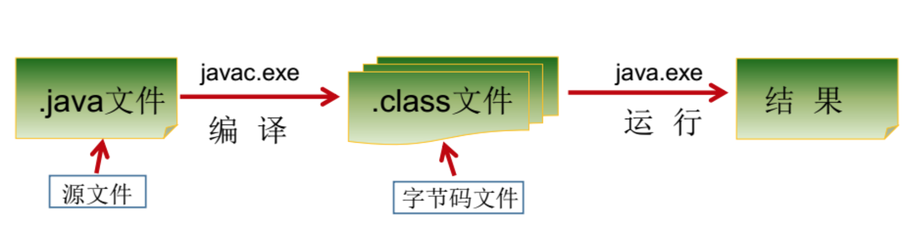     
java程序编写-编译-运行过程：
(先)
编写：我们将编写的java代码保存在以".java"结尾的源文件中
编译：使用javac.exe命令编译我们的java源文件。格式：javac 源文件名.java。编译以后会生成一个或者多个字节码文件，字节码文件的文件名与java源文件中的类名相同
解释运行：使用java.exe命令去解释运行我们的字节码文件。格式：java 类名

PS：在一个Java源文件中可以声明多个class。但是，只能最多有一个类声明为public，而且要求声名为public的类的类名必须与源文件相同    

## JDK与JRE   
### JDK(java开发工具包)      
是给java开发人员使用的,其中包含了java的开发工具,也包括了JRE.所以安装了JDK,就不需要再安装JRE   
其中的开发工具:编译工具(javac.exe),打包工具(jar.exe)等    
### JRE(java运行环境)     
包括java虚拟机和java程序所需的核心类库等   
如果想要运行一个java程序,计算机中只需要安装JRE即可     
### 安装jdk   
点击下载链接:https://www.oracle.com/java/technologies/downloads/#java8    
选择Mac版本:   
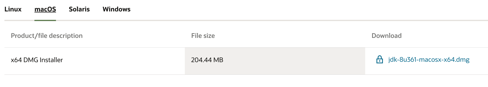    
检验是否安装成功:      
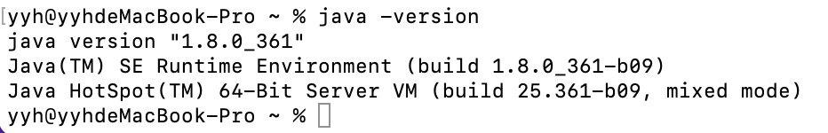     
查看安装目录:`/usr/libexec/java_home -V`     
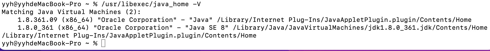     
### 配置环境   
第一次配置环境变量，可以使用`touch .bash_profile`创建一个 .bash_profile的隐藏配置文件     
然后再输入`open -e .bash_profile`命令打开配置文件窗口    
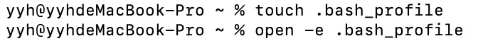     
在配置文件窗口内输入如下内容：         
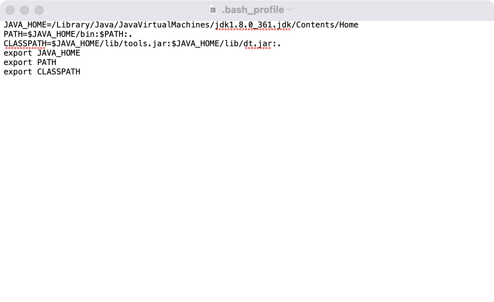    
在Mac终端使用`source .bash_profile`使配置文件生效     
输入`echo $JAVA_HOME`显示刚才配置的路径，配置完成     
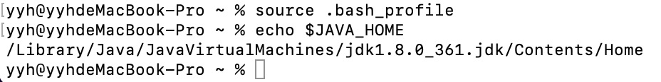      

## 第一个Java代码   
### 创建一个后缀名为.java的文件    
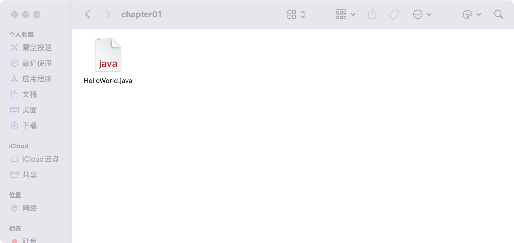      
### 在文件里编写如下代码：      
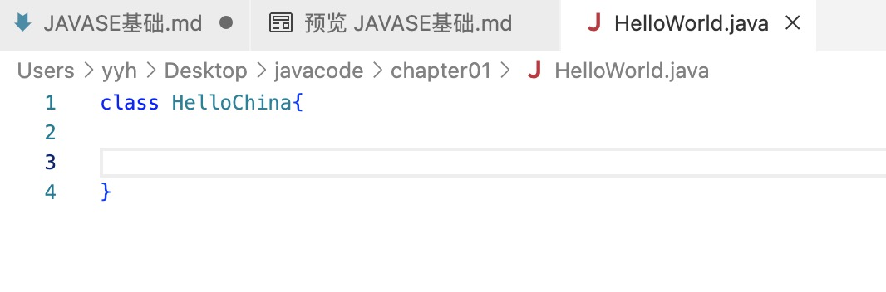   
java代码都是放在一个类(class)中，格式为:class 类名{}        
### 使用`javac 原文件名.java`编译java文件    
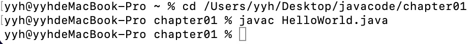     
然后生成一个.class文件：     
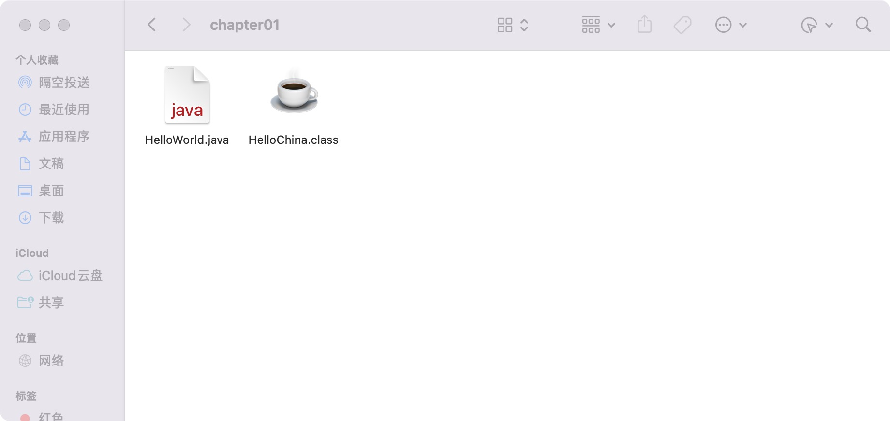    
.class是字节码文件，与类名相同      
### 使用`java 字节码文件名`运行文件    
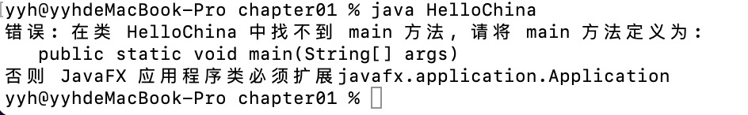    
显示缺少一个方法，相当于程序的入口     
### 修改java文件的内容    
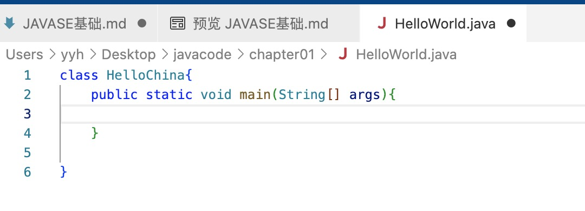    
### 重新编译、运行文件   
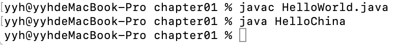      
没有错误提示，但也没有输出结果    
### 再次修改java文件的内容    
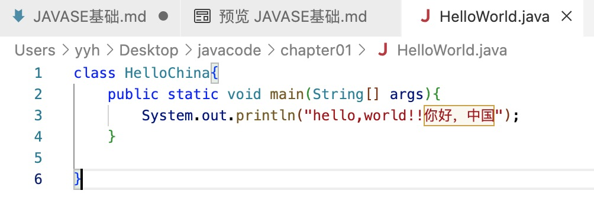    
注意，括号里面的字符串要用双引号   
 
 ### 再次编译、运行文件    
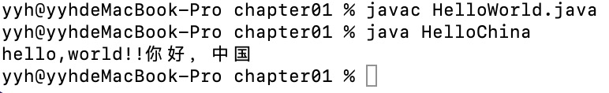    

## 说明     
### 编写说明  
其中,    
- class:关键字，表示"类",后面跟着类名   
- main()方法的格式是固定的:`public static void main(String[] args)`(不要随意修改),表示程序的入口     
如果非要变化的话，可以写成:1.String args[] 2.String[] a   
args:arguments,简写成agrs a        
- java程序是严格区分大小写的    
- 从控制台输出数据的操作:   
`System.out.println();` 输出数据后会换行    
`System.out.print();` 输出数据后不会换行       
- 每一行执行语句以';'结束      
### 编译说明    
1.如果编译不通过：   
- 编译的文件名、文件路径是否书写错误    
- 查看代码中是否存在语法问题     

2.编译以后会生成一个或多个字节码文件，每一个文件对应一个java类，且字节码文件名与类名相同    
### 运行说明   
1.我们是针对字节码文件的java类进行解释运行，注意区分大小写    
2.如果运行不通过：     
- 查看解释运行的类名、字节码文件名是否书写错误    
- 可能存在运行时异常   

一个原文件中可以声明多个类，但是最多只能有一个类使用public进行声明，且要求与原文件名相同
    

