# GIT使用方法  
## 1.配置全局账号    
git config --global user.name "Xhhajgdh"       
git config --global user.email "1913145200@qq.com"       
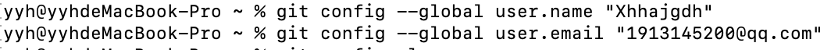     
(注意引号前有空格,名字和邮箱均为github的名字和邮箱)      
查看配置文件:git config -l     
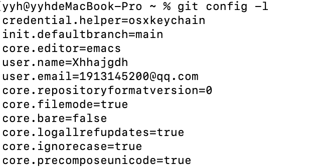     
## 2.配置SSH公钥     
参照链接:[SSH公钥配置](https://blog.csdn.net/weixin_44834981/article/details/127489440) [SSH密钥配置](https://blog.csdn.net/inthat/article/details/109406553)     
进入ssh目录:cd ~/.ssh     
查看是否已存在公钥:ls     
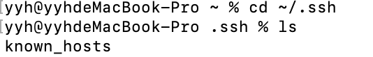    
检查目录下是否有名为id_rsa.pub文件/公钥文件s.png     
已存在就不需要新的公钥,可直接打开该文件获取公钥:cat id_rsa.pub     
SSH公钥:公钥.png     
删除旧公钥:mkdir key_backup/cp id_rsa* key_backup/rm id_rsa*     
生成公钥:ssh-keygen -t rsa -C "邮箱"     
(后面出现的提示可直接回车进行无密码设置)      
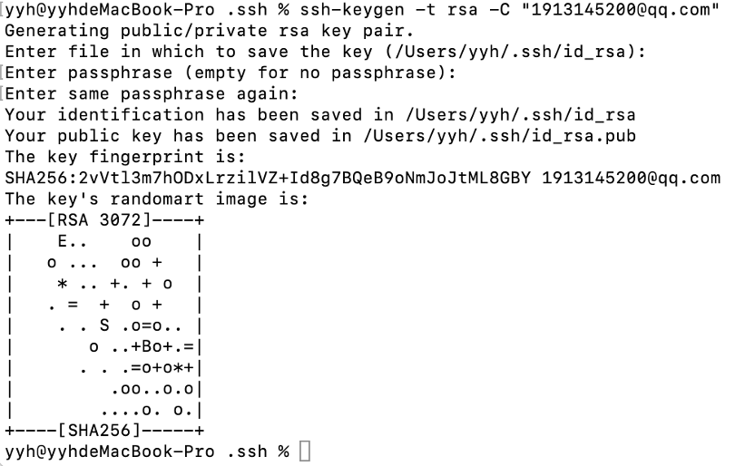     
生成后ls查看生成的公钥     
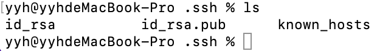     
打开.pub文件:cat id_rsa.pub     
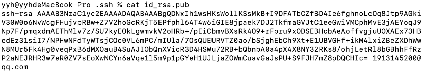   
配置在github上:     
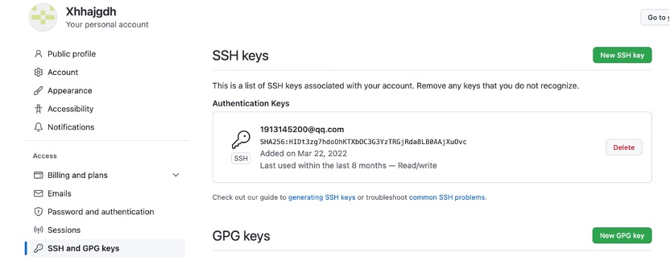     
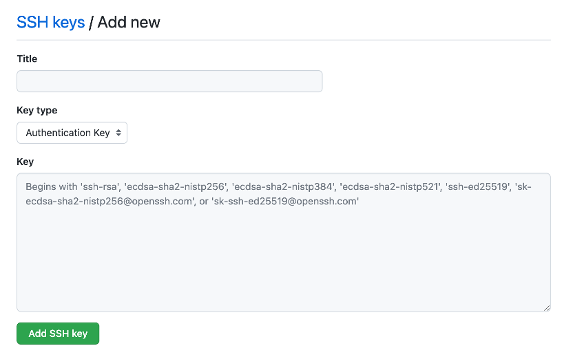     
验证是否配置成功:ssh -T git@github.com     
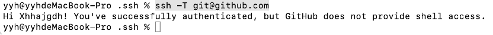    
## 3.推送文件到github中      
参考链接:[git的使用配置](https://www.cnblogs.com/henryw/p/10628156.html)    
进入本地文件夹:cd/users/...    
进行git初始化:git init(生成一个本地的git仓库)    
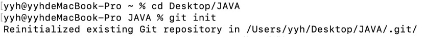    
添加到本地仓库git中:git add 文件名(最好为英文不要有空格)    
查看git信息,可以看到已添加的文件:git status    
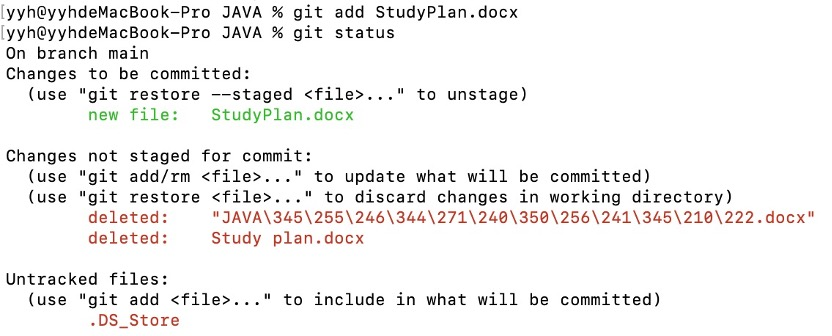      
对文件进行标记,利于区分:git commit -m ‘提示符’      
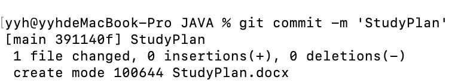      
查看执行过的commit操作:git log      
(如图所示,这之前执行了三次commit操作)      
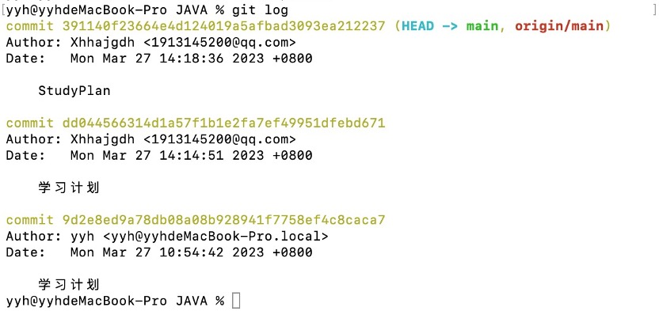       
关联到github账户:git remote add origin git@github.com:Xhhajgdh/JAVA.git      
推送到github仓库中:git push -u origin master      
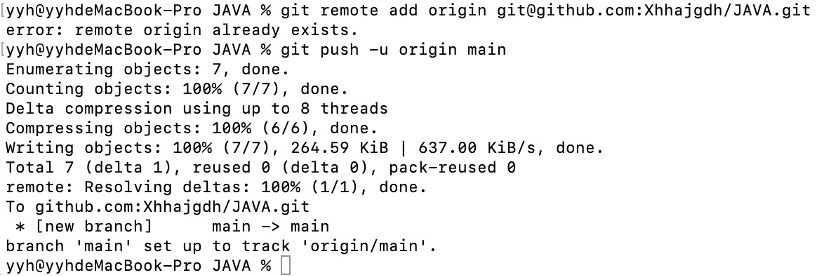       
## 4.基于主分支创建一个新的分支:git checkout -b 分支名      
     
(并且同时切换到two分支)    
在two分支下执行修改操作:     
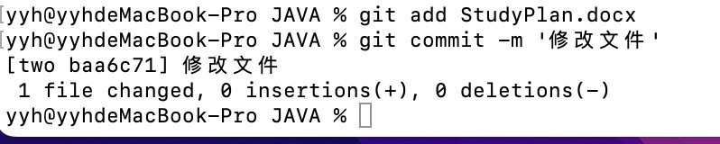     
(在two分支下执行的操作并不会合并到主分支中)      
然后将two分支执行的操作推到远端仓库中:git push -u origin two      
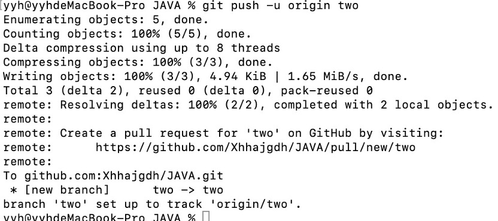     
此时远端github仓库中已经存在两个分支:      
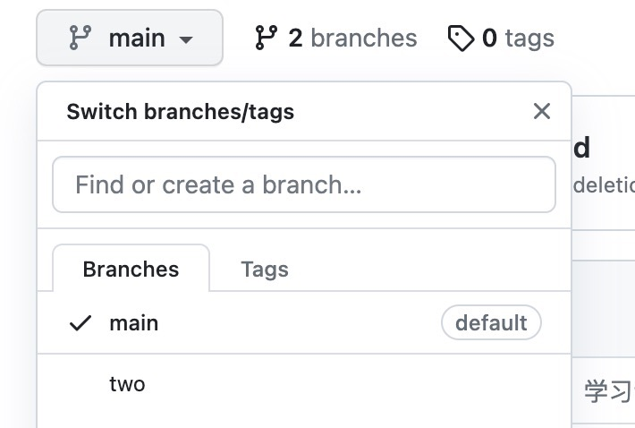      
请求将two分支合并到主分支中:pull request按钮      
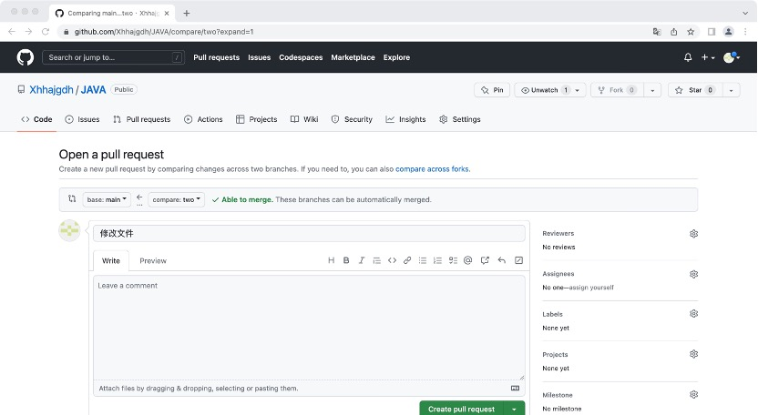     
请求成功后,可在主分支下看到two分支进行的commit操作(git log)      
## 5.总结        
语句git push -u origin master,就是将本地的master分支,推送到远端的master分支上      
把本地仓库push到远端仓库,这个过程中本地的仓库叫git仓库,远端的仓库叫github仓库,在push之前的操作,都是在对本地仓库git仓库操作,也就是说,所有的操作都是操作的本地操作,只有push是把本地仓库更新到远端仓库     
除此以外,远端仓库也不一定是github平台的,也有可能是其他平台的,如gitlab或者gittee等,github是一个开源网站,上面有很多git仓库   