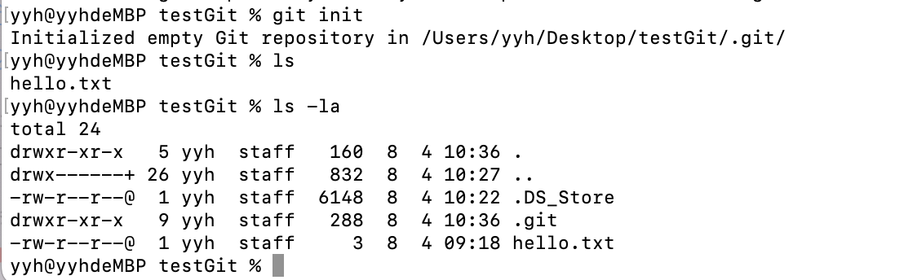

# 关于GIT 
## 什么是GIT？
**GIT是一个分布式版本控制系统（Distributed Version Control System，简称 DVCS）**    
### 分布式版本控制系统 VS 集中式版本控制系统   
**1.分布式版本控制系统（Distributed Version Control System，DVCS），是一种允许多个开发者在各地进行协同工作的版本控制系统。在这个系统中，每个项目不仅拥有项目的当前版本，而且拥有整个版本历史。**    
**分布式版本控制系统有以下特点：**
* **完全的历史版本库：每个开发者的计算机上都有一份完整的代码库。这意味着如果任何一个服务器出现故障，任何一个客户端都能恢复服务器上所有的数据。**     
* **可离线工作：由于每个开发者都有一个完整的历史版本库，他们可以在无网络的情况下进行许多操作，如提交更改、查看历史版本等。**    
* **强大的分支和合并功能：分布式版本控制系统通常提供非常强大的分支和合并功能，这使得开发者可以非常灵活地进行并行开发。**
* **更好的大型项目支持：与集中式版本控制系统相比，分布式系统通常更适合处理大型项目。由于每个开发者只需获取自己需要的部分，因此分布式系统可以更有效地管理大型代码库。** 

**GIT和Mercurial是当前两个最流行的分布式版本控制系统**   

**2.集中式版本控制系统（Centralized Version Control System，CVCS），是一种在网络服务器上维护版本库的方法，开发者通过网络从中获取最新的文件或提交更改。一些知名的集中式版本控制系统包括Subversion（SVN）和Perforce。**  
**在集中式版本控制系统中，有一个集中的服务器，存储所有的文件版本。开发者从这个集中的服务器上获取最新的版本，然后在本地进行修改。当修改完成后，将改动提交到集中的服务器。这种模式也被称为“检出-修改-提交”模式**     

**集中式版本控制系统有以下特点：**  
**优点：**    
* **权限管理方便：因为所有的版本信息都在一台集中的服务器上，所以权限管理更加方便**
* **方便管理：只需要备份一个地方即可**    

**缺点：**    
* **单点故障：如果中心服务器宕机，那么在修复期间，无法提交任何更新，也无法从中获取任何版本**
* **需要网络连接：为了提交更改或获取最新版本，必须连接到集中服务器，如果网络环境不佳，这可能成为瓶颈** 
* **慢速：因为每次获取和提交更改都需要连接到远程服务器，如果网络服务不佳，则有可能影响效率**

**3.分布式版本控制系统和集中式版本控制系统的区别**    
* **集中式版本控制系统 (如 SVN, CVS 等)：在这种系统中，版本历史存储在一个中心服务器上，每个用户只有文件的工作副本，而没有历史版本信息。当需要获取历史版本或者提交更改时，需要和中心服务器进行通信。这种方式的主要优势是版本控制过程简单直观，但是它的弱点也显而易见：一旦中心服务器出现问题，可能会导致版本历史丢失，而且在没有网络的情况下无法查看版本历史或提交更改。**    

* **分布式版本控制系统 (如 Git, Mercurial 等)：在这种系统中，每个用户不仅有文件的工作副本，还有整个版本历史的副本。也就是说，每个人都有一个完整的仓库。这使得在没有网络的情况下仍可以查看版本历史和提交更改。同时，由于每个人都有完整的历史，所以即使某些服务器出现问题，也可以从其他用户那里恢复整个版本历史。分布式版本控制系统的缺点可能是需要更多的存储空间（每个人都有完整的历史），而且操作相对复杂一些。**    

## 1.配置全局账号    
`git config --global user.name "Xhhajgdh" `        
`git config --global user.email "1913145200@qq.com"`       
     
(注意引号前有空格,名字和邮箱均为github的名字和邮箱)      
查看配置文件:`git config -l `     
     
## 2.配置SSH公钥     
参照链接:[SSH公钥配置](https://blog.csdn.net/weixin_44834981/article/details/127489440) [SSH密钥配置](https://blog.csdn.net/inthat/article/details/109406553)     
进入ssh目录:`cd ~/.ssh`     
查看是否已存在公钥:ls     
    
检查目录下是否有名为id_rsa.pub文件/公钥文件s.png     
已存在就不需要新的公钥,可直接打开该文件获取公钥:`cat id_rsa.pub `    
SSH公钥:公钥.png     
删除旧公钥:`mkdir key_backup`;`cp id_rsa* key_backup`;`rm id_rsa*`    
生成公钥:`ssh-keygen -t rsa -C "邮箱" `    
(后面出现的提示可直接回车进行无密码设置)      
     
生成后ls查看生成的公钥     
     
打开.pub文件:`cat id_rsa.pub `    
   
配置在github上:     
     
     
验证是否配置成功:`ssh -T git@github.com`     
    
## 3.推送文件到github中      
参考链接:[git的使用配置](https://www.cnblogs.com/henryw/p/10628156.html)    
进入本地文件夹:cd/users/...    
进行git初始化:`git init`(生成一个本地的git仓库)    
    
添加到本地仓库git中:`git add 文件名(最好为英文不要有空格)`    
查看git信息,可以看到已添加的文件:`git status`    
      
对文件进行标记,利于区分:`git commit -m ‘提示符’ `     
      
查看执行过的commit操作:`git log `     
(如图所示,这之前执行了三次commit操作)      
       
关联到github账户:`git remote add origin git@github.com:Xhhajgdh/JAVA.git  `    
推送到github仓库中:`git push -u origin main  `    
       
## 4.基于主分支创建一个新的分支:`git checkout -b 分支名 `    
（也可以使用`git switch -c name`创建并切换分支） 
     
*(并且同时切换到two分支)*    
在two分支下执行修改操作:     
     
(在two分支下执行的操作并不会合并到主分支中)      
然后将two分支执行的操作推到远端仓库中:`git push -u origin two`      
     
此时远端github仓库中已经存在两个分支:      
      
请求将two分支合并到主分支中:pull request按钮      
     
请求成功后,可在主分支下看到two分支进行的commit操作(git log)     
* **使用`git branch`查看分支**    
* **使用`git branch name`创建分支**   
* **使用`git checkout -b name`或`git switch -c name`创建并切换分支**
* **使用`git switch main`或`git checkout main`切换到main分支**   
* **使用`git merge name`合并某分支到当前分支**   
* **使用`git branch -d name`删除分支**
## 5.删除文件       
使用`git rm`将已被追踪的文件（已经被add了的文件）同时从暂存区中和工作区中删除    

执行`git rm`操作    
   
出现错误提示，说明正在试图使用` git rm `命令来删除一个已经暂存（staged）的文件。然而，如果一个文件已经被修改并添加到了暂存区，那么Git会拒绝直接删除文件以防止你意外丢失已经做出的修改。使用`git rm -f`可以强制删除暂存区和工作区中的文件。    
       
使用`git rm --cached`将已追踪的文件变成未追踪的，但并不会删除工作区的文件     
      
### 重命名操作：`git mv [file-original] [file-renamed]`   
使用`git mv [file-original] [file-renamed]`将文件重命名或移动位置   
* `[file-original]` 是想要移动或重命名的原始文件的路径，`[file-renamed]` 是你想要的新文件名或新位置      

     
*注意，执行完后，只是会将这个更改保存到暂存区中，还未提交到Git仓库中*    
然后使用`git commit -m hello.txt`将这次操作提交到Git仓库中     
    
*提交到Git仓库后，则不会再在暂存区中显示*    
## 6.删除本地的git仓库      
要删除本地的Git仓库，其实就是删除.git目录。这个操作需要谨慎，因为一旦执行，将失去版本控制的所有历史记录。      
在项目的根目录下，你可以看到一个隐藏的.git文件夹，这个文件夹就是Git用来存储所有版本信息的地方。     
使用`ls -la`查看：    
     
运行`rm -rf .git`删除.git目录及其所有内容，即完全删除本地的Git仓库    

*注意需在根目录下运行！*     
## 7.版本回退与修改文件   
当我们修改一个已经被提交的文件后，输入`git status`查看文件状态    
    
这个输出告诉我们，name.txt被修改过了，但是还没有暂存。
使用`git diff`查看修改的内容    

其中：     
* `index fb46174..61ee4b9 100644`: 这是 Git 内部的文件版本指针，`fb46174` 是修改前的版本，`61ee4b9` 是修改后的版本。`100644` 表示文件的模式（它是一个八进制数，表示文件的 Unix 权限），在这里，`100644` 表示 `name.txt` 是一个普通文件
* `--- a/name.txt` 和 `+++ b/name.txt`: 这两行表示原始文件（a 版本）和新文件（b 版本）的路径
* `@@ -1 +1,2 @@`: 这是一个区块标头，显示了修改的具体位置。-1 表示原文件的修改开始的行数，+1,2 表示新文件的修改开始的行数及涉及的行数。所以，这个标头表示从原文件的第1行开始和新文件的第1行到第2行的更改
* `-My name is yyh.`: 这一行表示从原文件中被删除的内容。减号 - 开头表示这行被删除
* `+my name is yyh.` 和 `+What's your name`: 这两行表示添加到新文件的内容。加号 + 开头表示这行是新增的    

然后将这次修改提交到git仓库中
    
### 版本回退    
在git中，当前版本为HEAD，上一个版本为HEAD^，上上一个为HEAD^^，往上100个版本为HEAD~100      
要把当前版本回退到上一个版本，则执行`git reset --hard HEAD^`    
   
再次查看版本库的状态，发现已经没有第二次修改    
    
若想回到第二次修改的版本，则可以使用`git reset --hard 7568f`(7568f为它的版本号(哈希值)前几位，使用git log查看版本库状态时，commit后面的数字即为版本号)     
    
`git reflog`记录了每一次命令，也可以查看对应版本的commit id     
    
其中，最上面一行是最新事件    
* 如果在此次提交时HEAD指向了某个分支（例如 HEAD -> main），那么这个分支名就会被显示出来
* HEAD@{n}：这是引用日志的索引，表示当前HEAD在前n次操作之前的位置    
* "HEAD -> main" 表示当前 HEAD 正指向 main 分支    

### 撤销修改    
如果你修改了工作区的内容，但是你想恢复到上一个版本的状态，则使用`git checkout -- name.txt`，可以丢掉工作区的修改    
恢复前：    
     
恢复后：      
     
注意，这个操作有两种情况    
* 一种是，文件修改后还没有被放到暂存区中，现在撤销修改就可以回到原来的状态，如上述示例   
* 另一种是，文件已经被添加到了暂存区，然后进行了修改，执行撤销修改操作就可以回到暂存区的状态，但是，如果文件本修改后再添加到暂存区中，执行撤销操作是没有效果的     
      
可以看到，在add了之后，再执行撤销操作，是无法更改内容的，但是在add了之后，再次修改文件内容，再执行撤销操作，可以回到暂存区的状态      
### `git checkout -- file`与`git reset --hard HEAD^`的区别    
* `git checkout -- file`是针对工作区某个文件修改的撤销，不会影响暂存区或版本库中的内容   
* `git reset --hard HEAD^`则是用来将当前的HEAD指针回退到上一个提交版本，并且会将工作区和暂存区的内容全部恢复到该提交版本的状态     

## 8.远程仓库   
### 添加远程仓库    
使用`git remote add origin git@github.com:Xhhajgdh/Pratical-training.git`添加远程仓库   
其中，添加后，远程仓库的名字就是origin，这是Git的默认叫法，也可以改成别的，但是origin一看就是远程仓库   
### 推送到远程仓库    
使用`git push -u origin main`将本地库的内容推送到远程仓库上，使用`git push`命令其实是将本地的main分支推送到远程(一般是默认的是master分支，我这里是main)     
        
其中，我们第一次推送main分支时，使用了 **-u** 参数，Git不仅会将本地main分支的内容推送到远程新的main分支，还会将本地的main分支和远程的main分支关联起来，之后的推送可简化为`git push`，若想从远程仓库拉取该分支的更新时可直接使用`git pull`    
### 查看远程仓库信息     
使用`git remote -v` 查看远程库的信息   
     
如果想删除远程仓库，使用`git remote rm origin`       
### 从远程仓库克隆     
* 使用`git clone git@github..(远程库的URL)`  
* 但通常情况下，从远程库克隆时，在本地都只能查看到`main`分支，如果需要在`dev`分支上开发，就必须创建远程origin的dev分支到本地，使用`git checkout -b dev origin/dev`创建本地dev分支，然后在`dev`分支上进行修改后，再使用`git push origin dev`将dev分支push到远程   

## 9.分支管理2.0     
### 分支管理策略
通常情况下，合并分支时，GIT会使用Fast forward模式，但在这种模式下，删除分支后，会丢掉分支信息，如果要强制禁用Fast forward模式，GIT就会生成一个新的commit，这样，从分支历史上就可以看出分支信息。     
使用`--no-ff`参数禁用Fast forward模式      
       
因为本次合并会创建一个新的 **commit** ，所以加上 **-m**参数，将commit描述写进去     

合并以后，使用`git log --graph --pretty==online --abbrev-commit`查看分支历史    
      

### Bug分支     
当你收到一个修复一个bug任务时，你想创建一个分支来修复它，但是，你此时正在dev分支上工作，并且还未提交，而且工作还未完成，提交不了，但是又必须在短时间内修复这个bug，怎么办？      
此时，GIT提供了一个**stash**功能，可以将当前工作现场存储起来，并在恢复现场以后继续工作。    
    
此时，已经修改了name.txt中的内容，并且还未提交，使用`git stash`存储现场，再次使用`git status`查看工作区就是干净的，然后可以创建分支来修复bug     

然后创建一个新的分支来修复"bug"     
   
然后使用`git stash pop`恢复现场    
    
其中，使用`git stash list`查看刚才的工作现场，然后使用`git stash pop`来恢复现场，也可以使用`git stash apply`来恢复，但是恢复后并不会删除stash内容，还需要使用`git stash drop`来删除，但是 **`git stash pop`** 恢复的同时也把stash内容删除了，然后再次`git stash list`就看不到任何stash内容了。      
**你可以多次stash，在恢复的时候，先用`git stash list`查看，然后用命令`git stash apply stash@{0}`来恢复指定的stash。**       
**如果在main分支上修复的bug，想要合并到当前dev分支，使用`git cherry-pick <commit>`命令，将bug提交到修改“复制到当前分支”,避免重复。**   

### Feature分支和Rebase     
* 一般情况下，每增添一个新功能时，最好新建一个feature分支。    
* 如果要丢弃一个还未被合并的分支，使用`git branch -D <name>`进行强行删除  
* 当多人协同在一个分支上工作时，后push的人需要从远程库pull最新提交，在本地合并后，才能push成功，此时的历史分支提交变得很复杂，可以使用`git rebase`将分支的提交历史整理成一条直线，看上去更加直观    

## 10.一些小结     
一般来说，想要将本地的一个文件推送到远程的github仓库中包含以下步骤：    
* 进入项目所在的目录，进行“git init”操作，生成一个本地的git仓库
* 执行"git add 文件名"，将要添加的文件添加到暂存区中，"git add ."可以将该目录下的所有文件都添加到暂存区中
* 执行"git commit -m "操作名" "，将所做的更改（即执行"git add"命令后暂存的那些更改）提交到本地仓库的历史提交中，这个提交生成了一个唯一一个id（哈希值），代表了一个新的历史状态
  * 如果想看到这次"commit"提交了哪些更改，可以使用"git log"命令来查看提交历史，然后使用" git show <commit_id> "命令（其中 <commit_id> 是你想查看的提交的 ID）来查看那次提交具体改变了什么       
* 执行"git remote add origin http://... "操作，将github中的某个仓库添加为远程仓库，其中，"http://..."是github中某个仓库的URL      
* 执行"git push -u origin main"将变更推送到上面添加的github仓库中    

多人协作的工作模式通常为：      
* 首先，可以试图用`git push origin <branch-name>`推送自己的修改

* 如果推送失败，则因为远程分支比你的本地更新，需要先用`git pull`试图合并；

* 如果合并有冲突，则解决冲突，并在本地提交；

* 没有冲突或者解决掉冲突后，再用`git push origin <branch-name>`推送就能成功！

* 如果`git pull`提示`no tracking information`，则说明本地分支和远程分支的链接关系没有创建，用命令`git branch --set-upstream-to <branch-name> origin/<branch-name>`。       
## 11.注意
### 工作区VS暂存区     
在 Git 中，工作区和暂存区是两个不同的概念：     

**工作区Workspace**：*（相当于本地的文件）* 工作区是你正在对文件进行更改的地方，也是你可以看到和编辑的文件。这些文件包含了你的项目所有的文件和目录，这些文件可能已经被 Git 追踪（也就是说它们已经被添加到 Git 仓库中），也可能还没有被 Git 追踪。     

**暂存区Index / Stag**： 暂存区（也被称为"索引"或"缓存"）是一个中间区域，用于准备下一个提交。当你运行 "git add" 命令时，你正在告诉 Git "我想在下一次提交中包含这个文件的更改"。这些更改会被添加到暂存区中。你可以添加、更新或删除暂存区中的内容，直到你满意为止，然后运行 git commit 来创建一个新的提交，包含暂存区中所有的更改。      

* 暂存区是 Git 的一个特性，使得你可以选择性地提交文件的一部分或全部更改，而不是一次性提交所有未提交的更改。例如，如果你在两个文件上都做了更改，但只想提交其中一个文件的更改，你可以使用 "git add" 将这个文件的更改添加到暂存区，然后运行 "git commit"。  

* 然后当你执行 "git commit" 命令后，暂存区中的更改就会被永久性地保存到 Git 仓库的历史记录中，这时候这些更改就被认为是"已提交"的。这些提交的历史记录构成了你的 Git 仓库。
 
总的来说，工作区和暂存区允许你更细粒度地控制你的提交和更改。你可以在工作区中自由地更改文件，然后选择你想要提交的更改，添加到暂存区，最后提交这些更改。      

### 可能的误区
语句`git push -u origin main`，就是将本地的`main`分支，推送到远端的`main`分支上。  

把本地仓库`push`到远端仓库,这个过程中本地的仓库叫**git仓库**,远端的仓库叫**github仓库**,在`push`之前的操作,都是在对本地仓库**git仓库**操作,也就是说,所有的操作都是操作的本地操作,只有`push`是把本地仓库更新到远端仓库.  

除此以外,远端仓库也不一定是**github**平台的,也有可能是其他平台的,如**gitlab**或者**gittee**等,**github**是一个开源网站,上面有很多**git仓库**  

